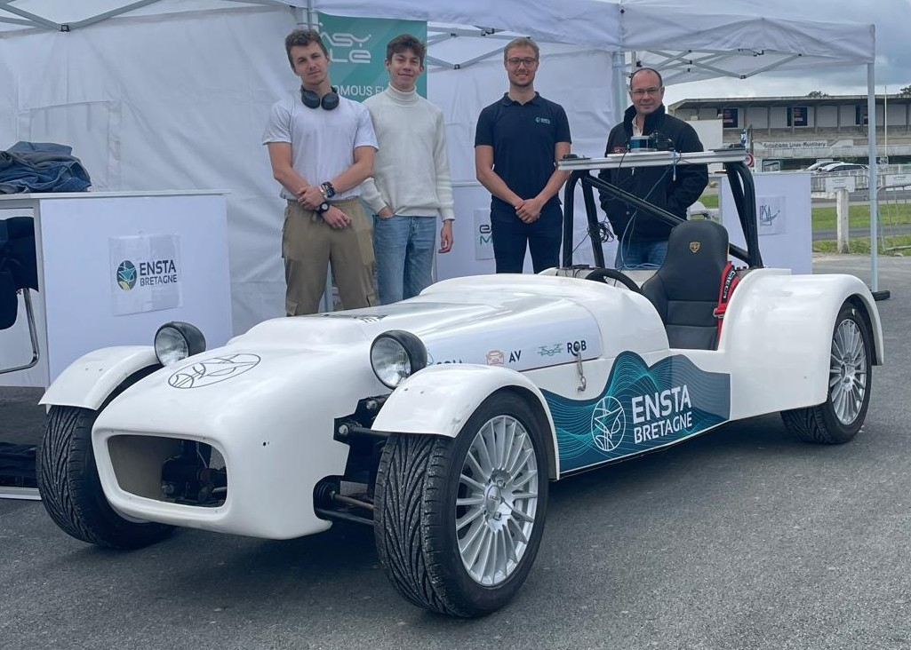
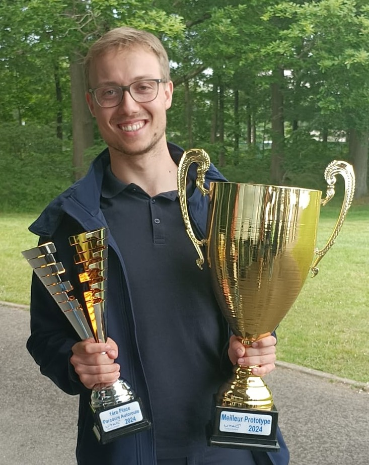

# UTAC competition's highway challenge

`23nd of May 2024`

See our poster [here](Poster_Challenge_UTAC.pdf).

## About UTAC and the competition

UTAC is a French company that specializes in vehicle testing.

The UTAC competition's highway is a challenge where students have to automate a vehicle that can drive on the highway. The vehicle has to be autonomous and has to be able to follow the highway code. The competition is held at the UTAC test center in Montlhéry, France.

Next to the highway challenge, there was also urban challenge where the vehicle had to drive in a city environment and a parking challenge where the vehicle had to park itself. There were also some schools that participated with their own challenges.

## The team

I was part of a team of 6 students from ENSTA Bretagne. We were all in our 4th year of engineering school and we were all studying automation and robotics.

We were supervised by 3 teachers from the school. One was a teacher in automation and robotics and the others were teachers in vehicule architecture.

We started the project in December 2023 with one day a week dedicated to the project, except for the holidays and some other special occasions.
We had to present the project at school in April 2024 before leaving for our internships.
Since all of us left towatds different countries for our internships, only three of us could come back for the competition.

## Our vehicle

We automated a white Lotus Seven. We had to install all the sensors and actuators ourselves. We used a GPS, a camera, a LIDAR, and a radar. We also had to install a computer in the car to process all the data.

Here is a picture of our vehicle in front of three of our team members and one of our teachers:

## The highway challenge

The highway challenge had multiple goals:
* Drive on the highway while respecting the highway code but at a maximum speed of 50 km/h
* Go through a tunnel in the dark
* Detect an obstacle and stop before hitting it (or avoid it)

## Our results

Since the car was not operational at all when we started the project we had to work with simulations for most of the project. Because of some problems with the electryfying of the car we only had a week to test out the car.
In our simulations, we were able to drive on the highway and detect obstacles to stop before hitting them.
With the real car we were only able to detect the obstacles before hitting them.

The competition is not only focused on the end results but also on the way you work as a team, how you present your project and the work you have accomplished during the preparation before the challenge.
The jury was very impressed by our work, our demonstration and our presentation. Most of all, they wwere amazed by our documentation and the way we worked as a team.

Thanks to our hard work and our good results we won two awards:
* The 1st place of the highway challenge
* The award for the best prototype

###

## My role in the project before the competition

### LIDAR Velodyne Puck Lite

I was in charge of the LIDAR. I had to install it on the car and make sure it was working properly. I also had to process the data from the LIDAR and use it to detect obstacles.

Since nobody in the team and none of the teachers had any experience with LIDARs, I had to learn how to use it by myself. I read the documentation and I did some tests to understand how it worked.
Making the LIDAR run on Windows was quite easy and thanks to an application provided by Velodyne I was able to see the data from the LIDAR in realtime on the computer.
The challenge started once I checked if the LIDAR worked since I had to make it work on Linux.
I needed to install the drivers and the ROS package to make it work.
The problem was that we would only start the ROS classes 2 months later and I had to make it work before that.
After a lot of research and some help from the ROS community, I was able to make it work on Linux.
Thanks to Rviz I was able to see the data from the LIDAR in realtime on the computer.

But seeing the data was not what we needed, we needed to process it to detect obstacles.
I had to write a program that would process the data from the LIDAR and detect obstacles without knowing how to get the data from the LIDAR.
After some months I succeeded in tfindig out which ROS topic I had to subscribe to to get the data from the LIDAR and in what format it was.
Then I was able to write a program that would detect obstacles and stop the car before hitting them.

This program looked at the pointcloud and for all points close to eachother and at the same distance it would create a virtual object.
If this object was in the middle of the road the car would slow down gradually and stop before hitting it.
This method filtered out all the noise from the LIDAR and only detected the obstacles since random points would not be close to eachother nor at the same distance.

[Here](LIDAR/LIDAR.md) you can access a markdown I made explaining how to work with the LIDAR.

### Most of the manual work

In charge of most of the mechanical work, I had to install the LIDAR, the camera, the radar, and the computer in the car.
I created some supports for the sensors and the computer and made sure everything was placed correctly.

I also installed and connected the arduino to the car making sure that it worked properly and was safely placed.

### Assistance to the team leader

When I finished with the LIDAR, I started helping out the team leader, Nicolas Damageux with the simulations on CoppeliSim and the ROS structure of the project.
Our last weeks at school we also worked together trying out the car on our test track.
We calibrated to GPS and the camera in order to test our programs.
The following of the lines was not testable since it was adapted for a normal highway lane and not for an athletic track where there are a lot of lines confusing the program.
So we tested the waypoints direction. After some tuning, the car was able to follow the waypoints correctly.

## My role during the competition

During the competition we had to present our project to the jury. Therefore, we had to make a presentation and a demonstration of our project.

Take a look at our presentation [here](Challenge_UTAC_ENSTA_Bretagne.pdf).

During the presentation I mainly explained what we did with the LIDAR and how we processed the data to detect obstacles.

For the demonstration, when we arrived at the competition, we had already a bit forgotten how to run the car.
Since I was more considered as the team's technical expert or let's say fixer, I was the one who had to make the car work.
From the morning until our demonstration I spend my time doing that and working on the obstacle detection that we had never tried out t on the real car.
After 3 hours of intense work, I was able to make the car work and we were able to demonstrate the obstacle detection to the jury.

## Conclusion

This project was a great experience.
It really was an opportunity to learn a lot of new things and to work on a project from A to Z.
I learned a lot about LIDARs, about teamwork, and about how to present a project to a jury.
I also learned a lot about how to work under pressure and how to solve problems quickly.

I am very proud of what we accomplished and I am very happy that we won two awards.
I am also very happy that I was able to help my team and that I was able to make the car work during the competition.

Development of:

* Knowledge: LIDAR, digital image processing, automation of cars
* Skills: programming in C++, Python, ROS, Linux, mechanical work, LaTeX, MarkDown, PointClouds, CoppeliSim, Rviz, Arduino, RQT, Git
* Competencies: adaptability, creativity, autonomy, communication, organization, time management, teamwork, problem-solving