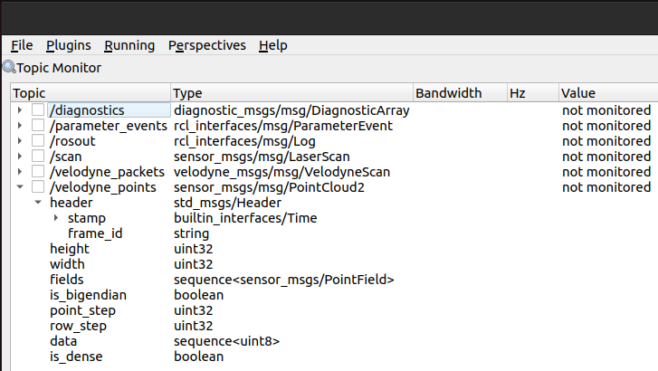

# How to use the LiDAR Velodyne PUCK Lite !
## I. Connecting

To connect, you need to plug in the LiDAR using its power cable, connect the Ethernet cable to the PC, and manually create an IPv4 address similar but not identical to the LiDAR's address (e.g., 192.168.10.91 becomes 192.168.10.92) in the computer's connection settings. You can verify if the LiDAR's address is visible on WireShark over Ethernet. Once this is done, turn off the WiFi and go to a search engine, then enter `192.168.10.91` in the search bar to access the LiDAR management page. Here, you can change the recipient numbers to properly link the two. 
Next, open VeloView and go to `Open > Sensor stream > VLP-16` to see all the points displayed.

## II. ROS2

### II.1. Installation

There is hardly any ROS2 documentation for Velodyne.

Do not search for packages to install.

Indeed, all Velodyne functions are already included in ROS2. Therefore, there is no need to waste time searching for them online.

However, the functions, etc., are already present in ROS2, but they still need to be activated! To do this, run: 
```sudo apt install ros-humble-velodyne…```
On the ellipsis, press Tab until you see the different choices and complete your command with the one you want. For example: 
```sudo apt install ros-humble-velodyne```
```sudo apt install ros-humble-velodyne-driver```
etc.

Keep in mind the multiple tabs to complete your commands! So when you type ros2..., it will show you the different possible commands with ros2.

### II.2. Usage

By choosing ```ros2 launch velodyne…```, you have many command sequence options. For example: 
```
ros2 launch velodyne velodyne-all-nodes-VLP16-launch.py
```
runs a code to retrieve values from the LiDAR.

However, it is written that it does it for the default IP address `192.168.1.201`. But our LiDAR has the IP address `192.168.10.91`, so we need to modify a file. The file that needs to be modified is located here: 
`/opt/ros/humble/share/velodyne_driver/config/`
and is named: 
`VLP16-velodyne_driver_node-params.yaml`
You need to open it in the terminal with: 
```
sudo gedit /opt/ros/humble/share/velodyne_driver/config/VLP16-velodyne_driver_node-params.yaml
```
This opens the document in a window where you can modify the IP address.
ATTENTION: MAKE SURE TO CREATE A COPY WITH `save as` BEFORE MODIFYING IT TO ENSURE YOU HAVE A WORKING VERSION!!!
Once the address is modified, you can run the commands in your terminal while being connected to the LiDAR.
Now, by running: 
```
ros2 launch velodyne velodyne-all-nodes-VLP16-launch.py
```
You will notice that not much is happening, but you need to open a new terminal and run commands to retrieve the data that is made accessible with the previous command.
Open another terminal and run: 
```
ros2 topic echo /velodyne_points
```
With this command, you will see the values displayed in a loop.
There are also other commands starting with ```ros2 topic echo``` /, so use Tab to see what is available.

PS: For some reason, my second terminal did not recognize ros2, so I had to first type: 
```
source /opt/ros/humble/setup.bash
```
That's all I have for now. If you have discovered anything to add, please write it below.

### II.3.1. Retrieve data from a ring

To retrieve data from a ring, first launch the LiDAR with the command: 
```
ros2 launch velodyne velodyne-all-nodes-VLP16-launch.py
```
Then, in another terminal, run: 
```
ros2 launch velodyne_laserscan velodyne_laserscan_node-launch.py
```
In another terminal, run: 
```
ros2 topic echo /scan
```
Here, you will see the data from ring -1 displayed.

### II.3.2. Retrieve data in Linux

To retrieve data from the LiDAR, first launch the LiDAR with the command: 
```
ros2 launch velodyne velodyne-all-nodes-VLP16-launch.py
```
Then, in another terminal, run: 
```
ros2 topic echo /velodyne_points
```
This will display the data in a loop.
To retrieve the data, run: 
```
ros2 topic echo /velodyne_points > filename.txt
```
This will create a text file with the LiDAR data.
To stop it, press Ctrl + C.

### II.4. Visualize data in Linux

To visualize the LiDAR data, first launch the LiDAR with the command: 
```
ros2 launch velodyne velodyne-all-nodes-VLP16-launch.py
```
Then, in another terminal, run: 
```
rviz2
```
This will open a window with a black background and options on the left.
Click on `Add`, then `By topic`, and choose `PointCloud2`.
Next, replace `map` with `velodyne`, and you should see the LiDAR data displayed.

You can change the point size, color, etc.

### II.5. Process topics

To check the message type returned by the LiDAR, run: 
```
rqt
```
This will open a window with options on the left.
Click on `Plugins`, then `Topics`, and choose `Topic Monitor`.
You can then select the topic you are interested in and see all the information about the message type returned.
For example, by clicking on `velodyne_points`, you can see that the message type is `sensor_msgs/msg/PointCloud2`.
You can also observe the types of data returned by the LiDAR, their names, etc. This can be useful for further analysis. (See image below)



### II.6. sensor_msgs/PointCloud2

#### Raw message definition
```
# This message holds a collection of N-dimensional points, which may
# contain additional information such as normals, intensity, etc. The
# point data is stored as a binary blob, its layout described by the
# contents of the "fields" array.

# The point cloud data may be organized 2d (image-like) or 1d
# (unordered). Point clouds organized as 2d images may be produced by
# camera depth sensors such as stereo or time-of-flight.

# Time of sensor data acquisition, and the coordinate frame ID (for 3d
# points).
Header header

# 2D structure of the point cloud. If the cloud is unordered, height is
# 1 and width is the length of the point cloud.
uint32 height
uint32 width

# Describes the channels and their layout in the binary data blob.
PointField[] fields

bool    is_bigendian # Is this data bigendian?
uint32  point_step   # Length of a point in bytes
uint32  row_step     # Length of a row in bytes
uint8[] data         # Actual point data, size is (row_step*height)

bool is_dense        # True if there are no invalid points
```
#### Compact message definition
```
std_msgs/Header header
uint32 height
uint32 width
sensor_msgs/PointField[] fields
bool is_bigendian
uint32 point_step
uint32 row_step
uint8[] data
bool is_dense
```
This is an example of the extracted data:
```
header:
  stamp:
    sec: 1710243989
    nanosec: 421943552
  frame_id: velodyne
height: 1824
width: 16
fields:
- name: x
  offset: 0
  datatype: 7
  count: 1
- name: y
  offset: 4
  datatype: 7
  count: 1
- name: z
  offset: 8
  datatype: 7
  count: 1
- name: intensity
  offset: 12
  datatype: 7
  count: 1
- name: ring
  offset: 16
  datatype: 4
  count: 1
- name: time
  offset: 18
  datatype: 7
  count: 1
is_bigendian: false
point_step: 22
row_step: 352
data:
- 0
- 0
- 192
- 127
- 0
- 0
- 192
- 127
- 0
- 0
- 192
- 127
- 0
- 0
- 192
- 127
- 0
- 0
- 242
- 209
- 203
- 189
- 0
- 0
- 192
- 127
- 0
- 0
- 192
- 127
- 0
- 0
- 192
- 127
- 0
- 0
- 192
- 127
- 1
- 0
- 136
- 207
- 203
- 189
- 0
- 0
- 192
- 127
- 0
- 0
- 192
- 127
- 0
- 0
- 192
- 127
- 0
- 0
- 192
- 127
- 2
- 0
- 29
- 205
- 203
- 189
- 0
- 0
- 192
- 127
- 0
- 0
- 192
- 127
- 0
- 0
- 192
- 127
- 0
- 0
- 192
- 127
- 3
- 0
- 179
- 202
- 203
- 189
- 0
- 0
- 192
- 127
- 0
- 0
- 192
- 127
- 0
- 0
- 192
- 127
- 0
- 0
- 192
- 127
- 4
- 0
- 72
- 200
- 203
- 189
- 0
- 0
- 192
- 127
- 0
- 0
- 192
- 127
- 0
- 0
- 192
- 127
- 0
- 0
- 192
- 127
- 5
- 0
- '...'
```
Here, the `fields` describe the composition of one point in the data.

So in the data, we have the `x`, `y`, `z` coordinates of the point, the `intensity` of the point, the `ring` of the point, and the `time` of the point as follows:

```
x x x x y y y y z z z z i i i i r r t t t t
```
This is why the `point_step` is 22 and the `row_step` is 352.

I imagine that the `ring` goes up to 16 because we have 16 rings on the LiDAR (width = 16).

So we have 16 points in the data, and each point is described by 22 bytes.

This means that one whole message describes one vertical line of the LiDAR.

Here is a different example to try out:
```
- 124
- 138
- 154
- 63
- 165
- 190
- 58
- 63
- 181
- 191
- 252
- 189
- 0
- 0
- 176
- 65
- 5
- 0
```
