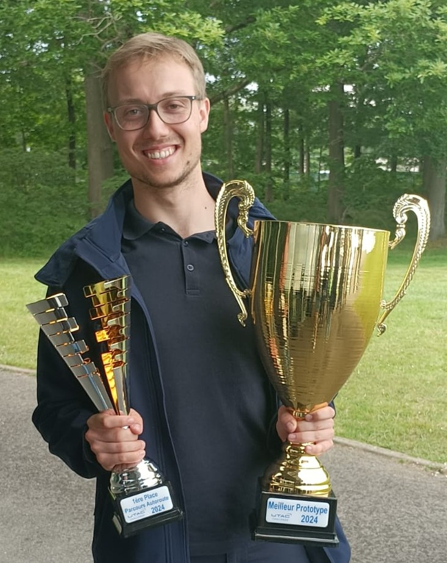

# UTAC competition's highway challenge
`23nd of May 2024`

See our poster [here](Poster_Challenge_UTAC.pdf).

## About UTAC and the competition

UTAC is a French company specializing in vehicle testing.

The UTAC competition's highway challenge requires students to automate a vehicle that can drive on the highway while following the highway code. The competition takes place at the UTAC test center in Montlhéry, France.

In addition to the highway challenge, there are also urban and parking challenges, as well as challenges from participating schools.

## The team

I was part of a team of 6 students from ENSTA Bretagne, all studying automation and robotics in our 4th year of engineering school.

We were supervised by 3 teachers, one specializing in automation and robotics, and the others in vehicle architecture.

We started the project in December 2023, dedicating one day a week to it (excluding holidays and special occasions). We presented the project at school in April 2024 before leaving for our internships. Only three of us were able to return for the competition due to internships in different countries.

## Our vehicle

We automated a white Lotus Seven, installing sensors (GPS, camera, LIDAR, and radar) and a computer to process the data.

## The highway challenge

The highway challenge had multiple goals:
* Drive on the highway while respecting the highway code, with a maximum speed of 50 km/h
* Go through a tunnel in the dark
* Detect and stop before hitting an obstacle (or avoid it)

## Our results

Due to initial non-operational status, we relied on simulations for most of the project. However, we only had a week to test the car due to electrical issues. In simulations, we were able to drive on the highway and detect obstacles to stop before hitting them. With the real car, we could only detect obstacles before hitting them.

The competition evaluates not only the end results but also teamwork, project presentation, and preparation work. The jury was impressed by our work, demonstration, presentation, documentation, and teamwork.

We won two awards:
* 1st place in the highway challenge
* Best prototype award

## My role in the project before the competition

### LIDAR Velodyne Puck Lite

I was responsible for installing and ensuring the proper functioning of the LIDAR. I also processed the LIDAR data to detect obstacles.

As no one in the team or the teachers had experience with LIDARs, I had to learn how to use it on my own. I read the documentation and conducted tests to understand its operation. I successfully made it work on Windows using an application provided by Velodyne. However, I had to make it work on Linux before starting the ROS classes. With help from the ROS community, I installed the drivers and ROS package to make it work. I used Rviz to visualize the LIDAR data in real-time.

To detect obstacles, I wrote a program that processed the LIDAR data. After months of research, I determined the ROS topic and format to obtain the data. The program created virtual objects for points close to each other and at the same distance, filtering out noise and detecting obstacles.

[Here](LIDAR/LIDAR.md) is a markdown explaining how to work with the LIDAR.

### Mechanical work

I installed the LIDAR, camera, radar, and computer in the car, creating supports and ensuring proper placement. I also installed and connected the Arduino.

### Assistance to the team leader

After completing the LIDAR work, I assisted the team leader with simulations on CoppeliSim and the ROS structure of the project. We also tested the car on our test track, calibrating the GPS and camera. The car successfully followed the waypoints.

## My role during the competition

During the competition, we presented our project and demonstrated it to the jury.

View our presentation [here](Challenge_UTAC_ENSTA_Bretagne.pdf).

During the presentation, I explained the LIDAR work and obstacle detection.

As the team's technical expert, I worked to make the car operational before the demonstration. After intense work, I successfully made the car work and demonstrated obstacle detection to the jury.

## Conclusion

This project provided a valuable learning experience, allowing us to work on a project from start to finish. I gained knowledge in LIDARs, teamwork, and project presentation. I also developed skills in programming, mechanical work, and various tools. The project enhanced competencies in adaptability, creativity, autonomy, communication, organization, time management, teamwork, and problem-solving.

I am proud of our accomplishments and winning two awards. I am also pleased to have contributed to the team's success during the competition.

Development of:

* Knowledge: LIDAR, digital image processing, automation of cars
* Skills: C++, Python, ROS, Linux, mechanical work, LaTeX, MarkDown, PointClouds, CoppeliSim, Rviz, Arduino, RQT, Git
* Competencies: adaptability, creativity, autonomy, communication, organization, time management, teamwork, problem-solving
