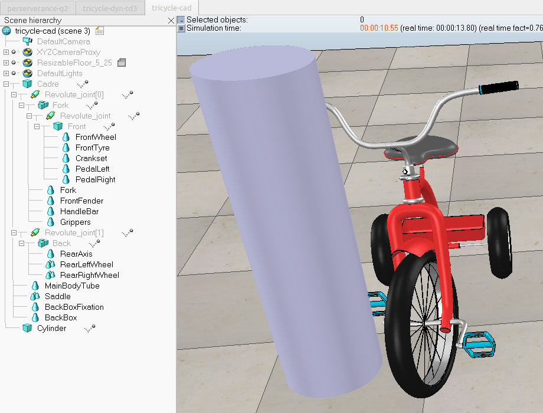
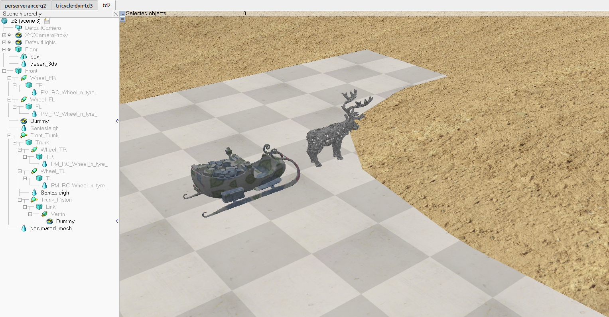
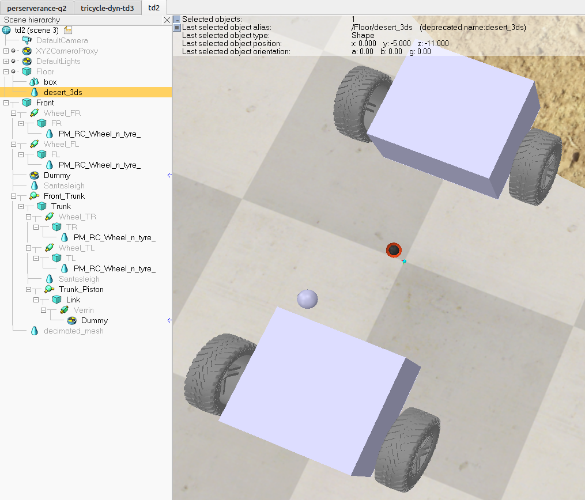
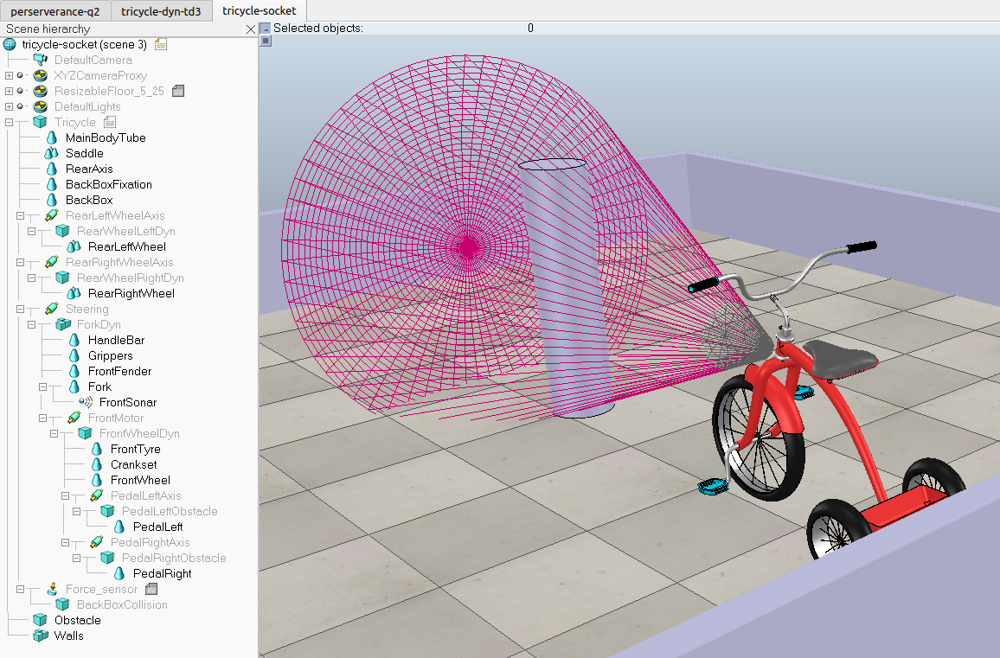
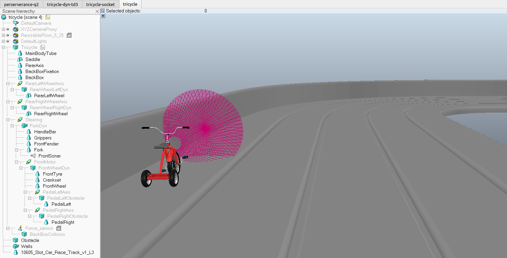
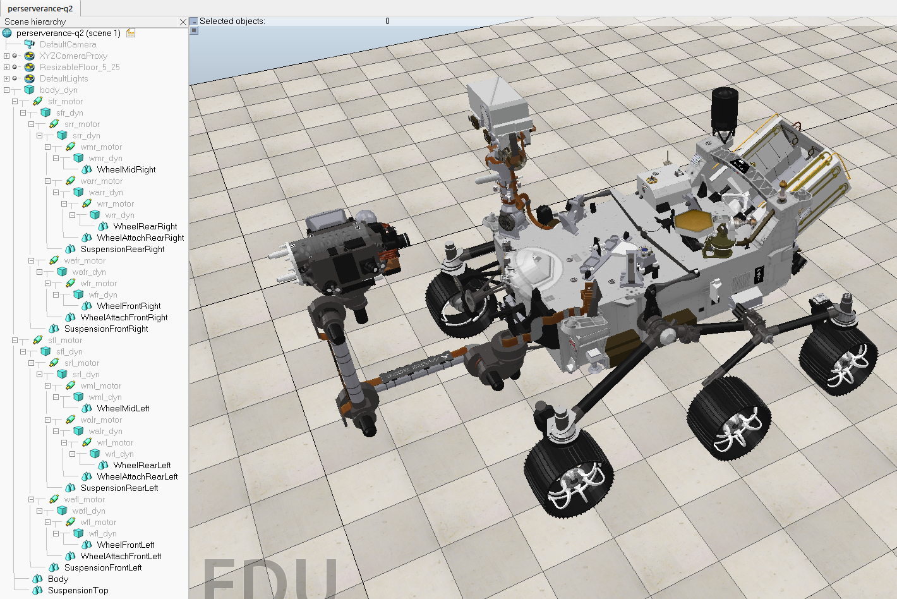
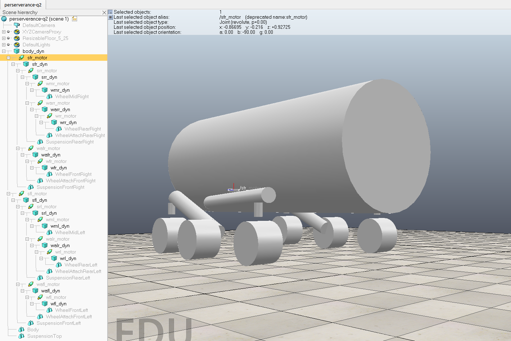

# Simulation on CoppeliaSim

Here is the [link](https://github.com/ArneMinem/Simulation) to the repository of the project.

## Introduction

Simulation was a class at school where we needed to learn how to simulate on CoppeliaSim while using python or C++ and ROS. The goal was to learn how to simulate a robot and make it move in a 3D environment. We also needed to learn how to use the API of CoppeliaSim to interact with the simulation.

We were given a few labs to do and a final project to complete. The final project was to make simulate NASA's Perseverance rover on Mars. We were alone to do all these tasks and the final project. Moreover, we only had 4 hours to do the final project.

## Tasks

### Task 1

First we had to make a simple simulation in CoppeliaSim. We had to make a trycicle interactble with its environment. We had to make it move forward until hitting an obstacle to see if it reacted correctly.

Here you have an image of the bycicle hitting the obstacle and a [video](https://youtu.be/4wyomtliKGg) of the simulation.:

### Task 2

The second task was as the first one but a bit more complex. We had to make a 4x4 robot with central articulation so that it could easily move around in all types of fields. We had to make it move forward in a desert ([video](https://youtu.be/ipUwq4ixCuw)).

Here is an image of the model of the robot used for simulation:

### Task 3

Now we had to make the trycicle from the first task in CoppeliaSim but without using CoppeliaSim. We needed to use the API of CoppeliaSim to make the trycicle with python. We also needed to make it move around in the simulation ([video](https://youtu.be/QY3VRDieQlo)).

### Task 4

This task consisted of controlling the trycicle with en external program by using sockets TCP/IP. The trycicle was locked between 4 walls and in front of an obstacle. We had to synchronize its sensor to our python script to make it move around the walls and avoid the obstacle ([video](https://IPonGC5t0fo)).
Here is an image of the simulation:

### Task 5

The last task was to have the trycicle move around while collecting its GPS position and sending it to an external program. 
Here is a [video](https://youtu.be/3Bsh65SA_-0) of the simulation and an image of the simulation:

### Final Project

For the final project we had 4 hours to simulate NASA's Perseverance rover on Mars. We needed to modelise the rover and the environment thanks to Python and CoppeliaSim. At first we had to make an easy model that we would program to advance and then turn on itself. Then we had to make the rover a lot more complex and detailled for it to move just like the normal one and be able to mave around on all sorts of different fields. Here is a [video](https://youtu.be/BCStnIrk6ec) of the simulation and images of the Perseverance rover as normal and as modelised for the simulation:

## Conclusion

This mini-project was very interesting. I had already had some experience with CoppeliaSim but always only as a user. This time I had to use the API of CoppeliaSim to make the robots move around. It was rewarding to see how we could interact with the simulation and make the robots move around.

I developed the following skills during this project:
- Python
- CoppeliaSim
- API of CoppeliaSim
- ROS
- TCP/IP
- 3D simulation