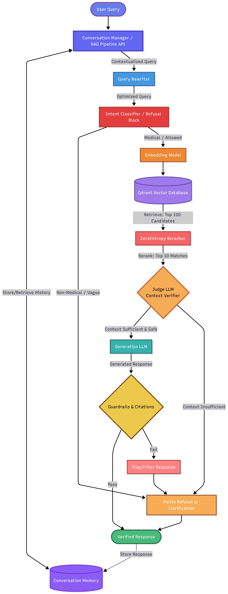

# Optimising Large Language Models for Medical Question-Answering: Reducing Hallucinations Using Retrieval-Augmented Generation

`January 2026 to April 2026`

See the full group report [here](Conversational_Agents_LLM_Hallucinations_1.pdf) and a desciption video [here](https://www.youtube.com/watch?v=1MFEyvN4laM).

## About the module

This project was carried out as part of the Conversational Agents module (F20/21CA) at Heriot-Watt University.

## The team

I was part of a team of 7 students from Heriot-Watt University, mixing MSc Robotics and MSc Artificial Intelligence backgrounds. The team worked together from January to April 2026, meeting regularly and coordinating remotely between sessions.

## The problem

Large language models can produce fluent and convincing answers on almost any topic, but they often hallucinate, generating information that sounds correct but is factually wrong. This is a serious risk in sensitive domains like healthcare, where an inaccurate answer can lead to real harm. Our project asked a simple question: can we reduce hallucinations by only letting a model answer questions it can ground in a trusted, given context?

## Our system

We built a medical chatbot that grounds every answer in the content of the NHS UK website, using a configuration-driven Retrieval-Augmented Generation (RAG) pipeline. The system combines a hybrid chunking strategy, semantic retrieval through a vector database, a cross-encoder reranker, an intent classifier, and an LLM-as-a-Judge that verifies the retrieved context and the generated response before anything reaches the user. Questions outside the scope of NHS knowledge are refused rather than guessed at.

The whole pipeline is defined at runtime through a JSON configuration, so components like the query rewriter, retriever, reranker, or refusal logic can be swapped, reordered, or extended without touching the underlying code.

## Our results

We evaluated the system through both automated testing (RAGAS, ROUGE, BERTScore) and manual review. On our own NHS-derived question set, the pipeline reached 92% faithfulness once refused questions were excluded, with strong context precision and recall. On an external, out-of-scope dataset (HealthFC), the system correctly identified that most questions fell outside NHS knowledge and refused them rather than fabricating an answer, which is exactly the safe behaviour we were aiming for. Manual review of 23 adversarial and dangerous questions confirmed the system reliably refused or corrected inappropriate queries, though the wording of some refusals still needs refinement.

## My role in the project

I focused on evaluation, since it was the area where I could add the most value while ramping up my knowledge of LLMs and RAG systems, which I researched independently early on to close the gap with the AI-specialist members of the team.

I designed and implemented an LLM-as-a-Judge pipeline in Langfuse to automatically evaluate the correctness of every incoming query, and built a set of 25 hand-annotated examples (query, answer, ground truth, score, explanation) to refine and calibrate the judge's prompt. I also explored Langfuse's dataset-based evaluation features to run correctness checks at scale.

Beyond evaluation, I planned the logical structure of our demonstration video and produced the final chatbot demo built around an optimal query flow. I also worked on an early front-end prototype in RASA, which the team later voted to drop in favour of a different approach as priorities shifted.

Throughout the project, I acted as note-taker and meeting lead whenever needed, proactively flagged bugs to the teammates responsible for them (Docker, scraping, memory, logging), and pushed for clearer documentation from less communicative members. I also contributed to reviewing and rewording the final report.

## Conclusion

This project gave me hands-on experience building and evaluating a full RAG pipeline, and a much clearer picture of where LLMs genuinely need external grounding versus where they can be trusted on their own. Working across a mixed Robotics and AI team also meant learning to contribute meaningfully to a highly technical NLP project despite starting with less background than some teammates, largely by taking ownership of evaluation and turning it into a concrete, well-documented contribution.

Development of:

* Knowledge: Retrieval-Augmented Generation, LLM hallucinations, LLM-as-a-Judge evaluation, medical AI safety
* Skills: Langfuse, prompt engineering, evaluation dataset design, RASA, technical writing, video/demo production
* Competencies: initiative, independent learning, communication, documentation, adaptability, teamwork