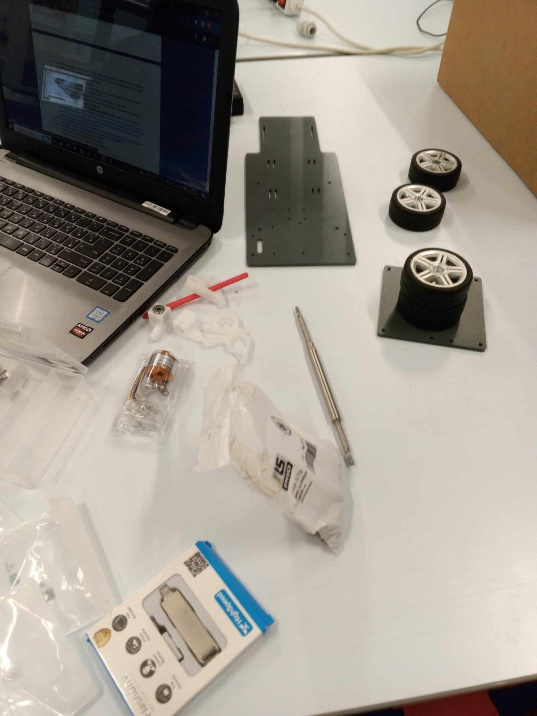

# Report : Atelier
Group: Salah SEKAR, Gabriel DUGUE, Louise LAPIE, Arne JACOBS

Here are some photos and videos showing the progress of our car creation.

## I. The beginning of the creation: 3D Printing

We took the parts designed by CAD to print them in 3D.
The printing took about 3 hours for two small parts, and once printed, we realized that as expected, they were not usable.
Indeed, the dimensions were correct, but on such small sizes, 3D printing is not very precise or solid.

Thus, when we had to insert the ball bearings into the printed parts, we encountered two problems:
* Either the hole was too big, and the bearings were not tight inside
* Or the hole was too small, and when trying to insert them, the printed part would break.

## II. Car assembly: main structure

In this image, we are about to start the assembly.
On the screen, we see the list of elements to gather, which we followed to obtain all the required parts.
For the red parts printed in 3D, we ultimately did not use them for the reasons mentioned earlier.
Instead, we used the provided white parts.
Here, we see: the white parts, the motor shaft, the motor, the tires, and the plate on which everything is mounted.

In the above images, we have two of our computers with the CAD representations on them to see how the car should be assembled.
The box behind the computer is for storing the car (in case you need to retrieve it).
We also notice that a significant part of the motor shaft is already assembled here.
In fact, to prevent the wheels from spinning freely, we had to add a small metal rod through the shaft to prevent free rotation of the wheels on this axis.
The diameter of the holes in the shafts was too small for these rods. So we enlarged them with the finest drill bit found in the ROB lab.

## III. Adding the battery

Here is an image of the car seen from above.
We can see that everything is assembled except for the drive wheels.

Indeed, we decided to mount them at the very end after testing the motor and steering function, as this way we could run the motor without risking the car running off.

After verifying that everything was working well, i.e., the steering, the motor, the connection to the control joystick, we added the two wheels to make the initial tests with the battery simply attached to the car with Velcro straps.

After testing the car on the ground, everything seemed to work fine, so we finished the assembly by adding the Raspberry Pi board.

## IV. Final state
Here are the images of the car as we left it at the end of the first semester.

You can also watch the 4 Test.mp4 videos to see that the car was working well.
PS: You can also ask Thomas LE MEZO what he thought of the car since he had some fun playing it.

